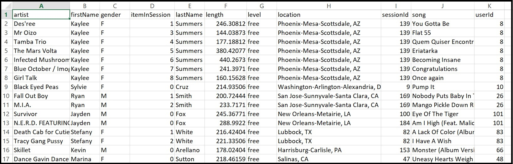

# Project: Data Modeling with Cassandra
This project is based on data modeling in Apache Cassandra. A company has collected a huge amount of data on songs and users' activities on its music streaming app. The company's analytics team is interested in knowing the songs users preferably listen to and needs a data engineer's professional assistance. For this reason, cassandra database otherwise known as keyspace ( in this project called ernest) and tables for specific  needs of the analytics team are prepared. The company's dataset is in a folder of csv files. 

First and foremost, extraction of the company's data is done by streamlining all the files into a single file. The data is then processed to limit the file to only the needs of the analytics team by creating a new csv file from which the newly created tables will be populated. 
There are two ipynb files, namely: apache_cassandra_project.ipynb and test.ipynb. The first is where extraction and transformation of the company's data are performed while the second file loads the analytics team's queries and performs verification of the database tables created.

# Software Packages
1. Apache Cassandra
2. cassandra-driver for python (pip install cassandra-driver)
3. Python

# Credits
This project is a part of Udadcity Data Engineering nanodegree program. Special thanks to the Udacity Data Engineering team for the supports and opportunity of this course. 
